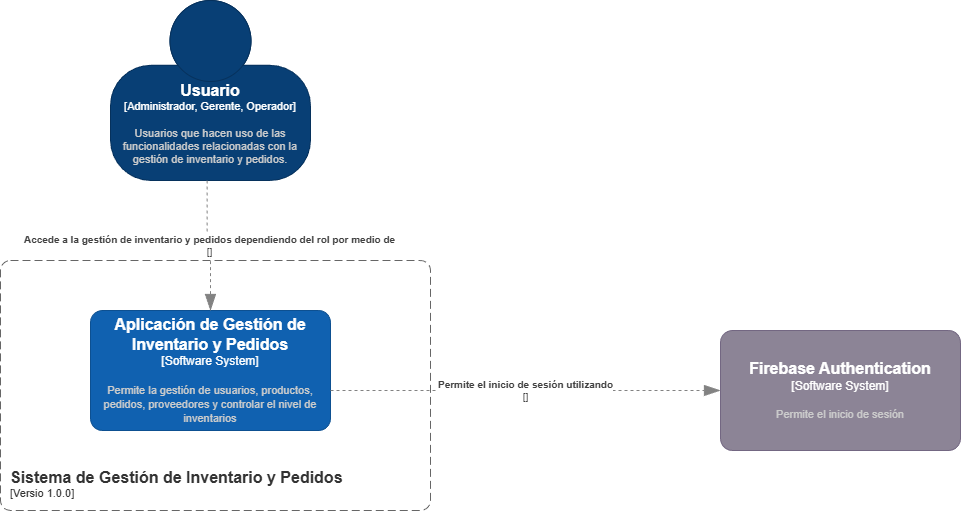
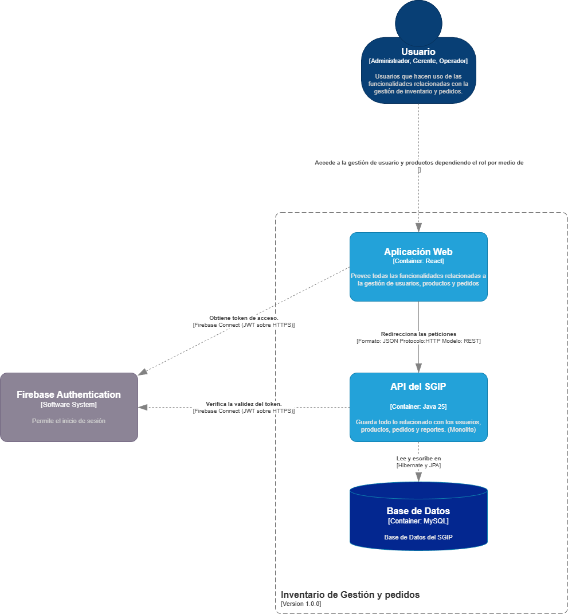
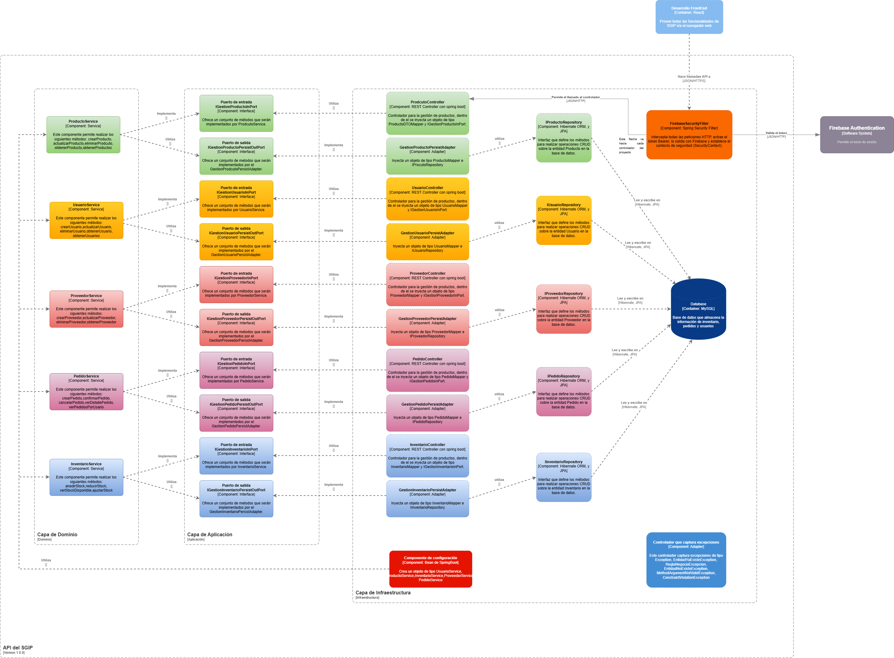

# SGIP - Inventory and Order Management System

> A robust, modular monolith application designed to manage enterprise inventory, suppliers, users, and sales orders efficiently.

## 📖 About the Project

SGIP (Sistema de Gestión de Inventario y Pedidos) is a full-stack application built to solve real-world business challenges. It manages the entire lifecycle of products, from supplier acquisition to final sale, ensuring data integrity and stock accuracy through transactional operations.

The project follows sophisticated architectural patterns to ensure scalability and maintainability, making it a production-ready solution.

### Key Features
* **Role-Based Access Control (RBAC):** Secure access for Admins, Managers, and Operators using Firebase Authentication.
* **Inventory Management:** Real-time tracking of stock, products, categories, and suppliers.
* **Order Processing:** Transactional creation of orders, ensuring inventory is accurately deducted only upon sale confirmation.
* **Transactional Integrity:** Uses ACID compliant database transactions to handle sales and stock adjustments simultaneously.

---

## 🏗️ Architecture & Design

This project avoids a chaotic monolithic structure by implementing a **Modular Monolith** architecture, heavily influenced by **Hexagonal Architecture (Ports & Adapters)** principles. This ensures that the core business logic is isolated from external frameworks and technologies.

### System Context (C4 Level 1)
Shows how the system interacts with users and external platforms like Firebase.



### Containers & Tech Stack (C4 Level 2)
High-level overview of the technical choices, including the split between the Frontend SPA, the Backend API, and the Database.



### Business Modules & Components (C4 Level 3)
A deep dive into the backend structure, showcasing the modular division (Identity, Inventory, Orders) and the Hexagonal flow (Controllers -> Input Ports -> Services -> Output Ports -> Adapters).



---

## 💾 Data Model

The application uses a **MySQL** relational database designed for third normal form (3NF) where appropriate, prioritizing data integrity and historical accuracy of sales records.


---

## 🛠️ Technology Stack

| Category | Technology | Description |
| :--- | :--- | :--- |
| **Backend** | Java 17 / 21 | Core language. |
| | Spring Boot 3 | Main framework for REST API. |
| | Spring Data JPA / Hibernate | ORM for database interactions. |
| | Firebase Admin SDK | Token validation and security integration. |
| | MapStruct | Efficient DTO <-> Entity mapping. |
| **Frontend** | [Pending Decision: Angular/React] | SPA Framework. |
| **Database** | MySQL 8 | Relational database engine. |
| **Security** | Firebase Authentication | Identity Provider (IdP). |
| **Tools** | Docker (Optional) | For containerization. |
| | Git & GitHub | Version control and documentation hosting. |

---

## 🚀 Getting Started (Local Development)

This is a monorepo containing both backend and frontend code. Follow these instructions to run the project locally.

### Prerequisites
* Java JDK 17 or higher.
* Node.js LTS and npm.
* MySQL Server running locally.
* A Firebase project setup with credentials downloaded.

### 1. Setting up the Database
Create a local MySQL database named `sgip_db` and configure your local credentials in `backend/src/main/resources/application-local.properties` (you need to create this file):

```properties
# Example application-local.properties
spring.datasource.url=jdbc:mysql://localhost:3306/sgip_db
spring.datasource.username=root
spring.datasource.password=your_password
```
2. Running the Backend (Spring Boot)
Open a terminal in the root folder and run:

Bash

cd backend
./mvnw spring-boot:run
The API will start at http://localhost:8080.

3. Running the Frontend
Open a new terminal in the root folder and run:

Bash

cd frontend
npm install
npm start
The application will likely start at http://localhost:3000 or http://localhost:4200.

👤 Author
[José David Chilito Cometa]

LinkedIn: https://www.linkedin.com/in/jose-david-chilito-cometa-7032922a2/

GitHub: @JChilito
